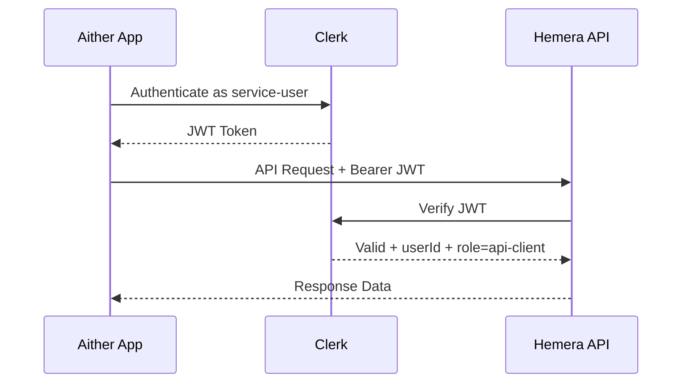

# Aither → Hemera API Integration Plan

## Kontext

Die **Aither-App** (Next.js + Clerk) muss auf die **Hemera API** zugreifen, um:
1. **Seminar-/Kursdaten lesen** (Courses, Bookings, Teilnehmer)
2. **Teilnehmer-spezifische Ergebnisse schreiben** (CourseParticipation-Felder: `resultOutcome`, `resultNotes`)

Beide Apps nutzen Clerk als Auth-Provider.

---

## Empfehlung: Dedizierter Service-User mit Clerk

### Warum NICHT den Admin-Account verwenden?

| Risiko | Beschreibung |
|--------|-------------|
| **Überprivilegierung** | Admin hat Zugriff auf alles - Aither braucht nur Kurs- und Teilnehmerdaten |
| **Audit-Verlust** | Alle Aither-Aktionen erscheinen als Admin-Aktionen im Log |
| **Credential-Kopplung** | Wenn Aither kompromittiert wird, ist der Admin-Zugang betroffen |
| **Session-Konflikte** | Admin-Sessions könnten durch parallele Nutzung gestört werden |

### Empfohlener Ansatz: Clerk JWT + Service-Rolle


**Implementierung von `getUserRole(userId: string)`**

Beispiel (Pseudocode, server-side):

```typescript
import { clerkClient } from '@clerk/nextjs/server';

export async function getUserRole(userId: string): Promise<string | null> {
  if (!userId) return null;
  try {
    const user = await clerkClient.users.getUser(userId);
    if (!user) return null;
    const role = user?.publicMetadata?.role;
    return typeof role === 'string' && role.length > 0 ? role : null;
  } catch (error) {
    console.error(`getUserRole: failed to fetch user ${userId}:`, error instanceof Error ? error.message : error);
    return null;
  }
}
```

Endpoint‑Änderung: Stelle sicher, dass `auth()` ein `userId` liefert, bevor `getUserRole(userId)` aufgerufen wird; wenn `userId` fehlt -> return 401; wenn `getUserRole` einen nicht erlaubten Wert liefert -> return 403. Später kann die einfache Rollenprüfung durch feinere Berechtigungsprüfungen ersetzt werden.


### Architektur-Optionen

#### Option A: Clerk Service-User mit eigener Rolle ⭐ Empfohlen

1. **Neuen Clerk-User anlegen** (z.B. `aither-service@hemera-academy.com`)
2. **Eigene Rolle zuweisen** via `publicMetadata`: `{ "role": "api-client" }`
3. **Hemera erweitern**: Neue Rolle `api-client` in `lib/auth/permissions.ts` mit eingeschränkten Rechten
4. **Aither**: Clerk Backend-SDK nutzen, um JWT zu generieren und an Hemera-API zu senden

**Vorteile:**
- Minimale Änderungen an Hemera (nur Rolle + Permissions erweitern)
- Clerk verwaltet Credentials zentral
- Audit-Trail zeigt klar "aither-service" als Akteur
- Gleiche Auth-Infrastruktur wie bestehende User

**Nachteile:**
- Service-User belegt einen Clerk-Seat
- JWT-Refresh muss in Aither gehandhabt werden

#### Option B: Clerk Machine-to-Machine (M2M) Token

1. **Clerk JWT Template** erstellen für Service-Zugriff
2. **API Key** in Clerk Dashboard generieren
3. **Hemera Middleware** erweitern für M2M-Token-Validierung

**Vorteile:**
- Kein User-Seat nötig
- Saubere M2M-Trennung

**Nachteile:**
- Clerk M2M ist ein neueres Feature, erfordert ggf. Plan-Upgrade
- Mehr Middleware-Anpassungen in Hemera nötig

#### Option C: Shared API Key (einfachste Lösung)

1. **API Key** als Environment Variable in beiden Apps
2. **Hemera**: Neuer Middleware-Check für `x-api-key` Header
3. **Aither**: API Key bei jedem Request mitsenden

**Vorteile:**
- Sehr einfach zu implementieren
- Keine Clerk-Abhängigkeit für Service-Kommunikation

**Nachteile:**
- Kein User-Kontext (kein Audit wer genau was tat)
- Key-Rotation muss manuell erfolgen
- Weniger sicher als JWT-basierte Lösung

---

## Empfohlene Implementierung: Option A

### Schritt-für-Schritt Plan

#### 1. Clerk: Service-User anlegen
- Neuen User in Clerk Dashboard erstellen: `aither-service@hemera-academy.com`
- `publicMetadata` setzen: `{ "role": "api-client", "service": "aither" }`

#### 2. Hemera: Neue Rolle `api-client` einführen

**Datei:** `lib/auth/permissions.ts`
- `UserRole` erweitern um `api-client`
- Permissions definieren:
  - `read:courses` ✅
  - `read:bookings` ✅
  - `read:participations` ✅
  - `write:participation-results` ✅
  - `manage:courses` ❌
  - `manage:users` ❌

#### 3. Hemera: Neue API-Endpunkte für Service-Zugriff

Neue Route-Gruppe `app/api/service/` mit:

| Endpunkt | Methode | Beschreibung |
|----------|---------|-------------|
| `/api/service/courses` | GET | Kurse mit Teilnehmerdaten lesen |
| `/api/service/courses/[id]` | GET | Einzelnen Kurs mit Buchungen lesen |
| `/api/service/participations/[id]` | GET | Participation-Details lesen |
| `/api/service/participations/[id]/result` | PUT | Ergebnis-Daten schreiben |

Jeder Endpunkt prüft:
```typescript
import { auth } from '@clerk/nextjs/server';

// Server-side guard for service endpoints — ensure the route handler is declared `async`
export async function GET(request: Request) {
  const { userId } = await auth();
  if (!userId) {
    return NextResponse.json({ error: 'Unauthorized' }, { status: 401 });
  }

  // getUserRole should be implemented using clerkClient.users.getUser(userId)
  const role = await getUserRole(userId);
  if (role !== 'api-client' && role !== 'admin') {
    return NextResponse.json({ error: 'Forbidden' }, { status: 403 });
  }

  // ... handler logic continues here
}
```

#### 4. Aither: Clerk Backend-SDK für API-Calls

Wichtig: Für Service‑zu‑Service Flows darf die Aither‑Seite **nicht** auf einen interaktiven User‑Session‑Token (sessionId) setzen. Stattdessen sollte Aither einen serverseitigen Service‑Token / API‑Key verwenden, der vom Clerk Backend SDK oder als dedizierter Service‑Credential verwaltet wird. Verwende ein explizites Token‑Caching/Rotation‑Pattern (siehe "JWT / Token Management" unten).

Pseudocode / Pattern (serverseitig in Aither):

```typescript
// Simple, robust option: read a pre-provisioned service credential from the environment
// (recommended). Store a pre-generated machine credential in your secrets manager and
// expose it as `CLERK_SERVICE_USER_API_KEY` (or as a sign-in token `CLERK_SERVICE_USER_SIGNIN_TOKEN`).
const tokenCache = new Map<string, { token: string; expiresAt: number }>();

async function getServiceToken() {
  const cacheKey = 'hemera-service-token';
  const cached = tokenCache.get(cacheKey);
  if (cached && cached.expiresAt > Date.now() + 120000) return cached.token;

  // Prefer a pre-provisioned key stored in the environment / secrets manager
  const envToken = process.env.CLERK_SERVICE_USER_API_KEY || process.env.CLERK_SERVICE_USER_SIGNIN_TOKEN;
  if (!envToken) {
    throw new Error('Missing service credential: set CLERK_SERVICE_USER_API_KEY or CLERK_SERVICE_USER_SIGNIN_TOKEN');
  }

  // Cache short-lived usage (expiresAt is approximate when using a static API key)
  const expiresAt = Date.now() + 15 * 60 * 1000;
  tokenCache.set(cacheKey, { token: envToken, expiresAt });
  return envToken;
}

const token = await getServiceToken();
const response = await fetch(`${process.env.HEMERA_API_BASE_URL}/api/service/courses`, {
  headers: {
    'Authorization': `Bearer ${token}`,
    'Content-Type': 'application/json',
  },
});
```

Implementierungs‑Hinweise:
- Lade `CLERK_SERVICE_USER_API_KEY` (oder `CLERK_SERVICE_USER_SIGNIN_TOKEN`) aus der Umgebung / dem Secrets-Manager. Das obige Muster verwendet einen statischen, vorab bereitgestellten Service-Credential — es wird zur Laufzeit kein Token dynamisch geminted.
- Implementiere `tokenCache` in Aither; for horizontal scalability use a shared cache (Redis, Vercel KV) instead of process memory.
- On 401 responses that include `WWW-Authenticate` or an expiry indication, refresh the credential from the environment once and retry the failed request (retry-on-expiry).

#### 5. Hemera: Middleware anpassen

**Datei:** `proxy.ts` (im Hemera-Repo, `proxy.ts` im Projekt‑Root) — Sicherstellen, dass `/api/service/*` Routen durch Clerk‑Auth gehen.

Implementierungs‑Hinweise für `proxy.ts`:
- `proxy.ts` ist der zentrale Next.js/Edge/Proxy‑Handler (siehe vorhandene `proxy.ts` im Repo). Ergänze dort oder importiere eine Middleware, die speziell Routen mit dem Muster `/api/service/*` abfängt und die Clerk‑Verifikation ausführt (z. B. `auth()` / `clerkMiddleware()` / `verifySession`).
- Die Middleware sollte das validierte `userId` und `role` in die Request‑Context/Headers injizieren, damit die eigentlichen Route‑Handler (`app/api/service/*`) die Rolle prüfen können.
- Exportiere den konfigurierten Handler / Middleware (z. B. `proxyMiddleware`) so er dort zentral verwendet werden kann.

### JWT / Token Management (zusätzliche Hinweise)

- Access token lifetime: Wir empfehlen kurze Access Tokens (z. B. 15 Minuten) und eine Refresh‑Cadence in Aither, die Tokens proaktiv erneuert (z. B. erneuern wenn <= 2 Minuten Gültigkeit verbleiben) oder alle 10 Minuten.
- Token Caching: Implementiere in Aither eine `getServiceToken()`‑Funktion mit einem `tokenCache` (in-memory für dev, Redis/Vercel KV für Production) und sichere Rotation.
- Retry on expiry: Wenn Hemera 401/WWW‑Authenticate zurückgibt, soll Aither einmal das Token erneuern und den Request erneut ausführen.
- Fehlerbehandlung: Wenn Refresh/Retries fehlschlagen, protokolliere und entferne fehlerhafte cached tokens, und schlage fehl mit 5xx/401 je nach Ursache.

---

## Datenfluss

```mermaid
flowchart LR
    subgraph Aither
        A1[Service Logic]
        A2[Clerk SDK]
    end

    subgraph Clerk
        C1[Service User JWT]
    end

    subgraph Hemera
        H1[/api/service/*]
        H2[Auth Middleware]
        H3[Permissions Check]
        H4[Prisma DB]
    end

    A1 --> A2
    A2 --> C1
    C1 --> H1
    H1 --> H2
    H2 --> H3
    H3 --> H4
```

## Sicherheitsaspekte

- **Principle of Least Privilege**: `api-client` Rolle hat nur die minimal nötigen Rechte
- **Audit Trail**: Alle Aktionen sind dem Service-User zugeordnet
- **JWT-Validierung**: Clerk verifiziert Token-Integrität und -Ablauf

### Rate Limiting (implementation guidance)

Use a server-side rate limiter to protect `/api/service/*`. Recommended library: `@upstash/ratelimit` with Upstash Redis.

Example (Node/Edge):

```ts
import Redis from '@upstash/redis';
import Ratelimit from '@upstash/ratelimit';

const redis = Redis.fromEnv();
const ratelimit = new Ratelimit({
  redis,
  limiter: Ratelimit.slidingWindow({ window: 60, limit: 120 }), // 120 requests/min per key
});

// In route handler
const identifier = userId || request.ip;
const result = await ratelimit.limit(identifier);
if (!result.success) {
  return new Response('Too Many Requests', { status: 429 });
}
```

Call `ratelimit.limit(identifier)` early in `/api/service/*` handlers. Choose `identifier` by priority: authenticated userId → client IP → service API key.

### IP Whitelisting

Configure allowlists in the deployment platform (Vercel Edge Config, cloud firewall, or load balancer) and gate them with an environment flag, e.g. `SERVICE_IP_ALLOWLIST=1` to enable. Keep whitelisting optional and configurable so you can disable it for non-prod environments. Document the source of truth for the list and how to update it.

### PII Redaction

Add a dedicated PII redaction step for all API responses returning bookings/participations. Implement a single transform function used by service endpoints to ensure consistent sanitization:

```ts
// Example shape
type CourseParticipation = { id: string; courseId: string; userId: string; resultOutcome?: string; resultNotes?: string; email?: string; phoneNumber?: string; billingAddress?: string; paymentMethod?: string; cardNumber?: string; transactionId?: string };

function sanitizeParticipation(participation: CourseParticipation) {
  // Keep allowed fields and pseudonymize userId
  return {
    id: participation.id,
    courseId: participation.courseId,
    userId: hashUserId(participation.userId), // pseudonymize
    resultOutcome: participation.resultOutcome,
    resultNotes: participation.resultNotes,
  };
}

// Audit logging when PII is accessed
function logPIIAccess(requesterId: string, fields: string[], reason: string) {
  // Implement audit entry: timestamp, requesterId, fields touched, reason, request id
}

// Guidance: Enumerate all PII fields centrally (email, phoneNumber, birthDate, fullName, billingAddress, cardNumber, transactionId, paymentMethod) and specify strategy per field (remove/hash/pseudonymize). Use a KMS-backed HMAC key or KMS envelope encryption for stable pseudonymization and rotate keys following your key rotation policy.


## Geklärte Rahmenbedingungen

| Frage | Antwort |
|-------|---------|
| Hosting | Hemera auf Vercel, Aither lokal/anderer Host |
| Datenzugriff | Kurse, Bookings und Participations. Sensitive booking fields are explicitly excluded from responses: `paymentMethod`, `cardNumber`, `billingAddress`, `transactionId`. `CourseParticipation` exposes only `id`, `courseId`, `userId` (pseudonymous), `resultOutcome`, and `resultNotes`. PII fields (e.g., `email`, `phoneNumber`, `birthDate`, `fullName`) are redacted or hashed before returning. |
| Clerk-Plan | Free/Hobby - kein M2M verfügbar → **Option A bestätigt** |

---

## Implementierungs-Tasks (Hemera-Seite)

- [ ] Clerk: Service-User `aither-service@hemera-academy.com` anlegen und `publicMetadata.role = "api-client"` setzen
- [ ] `lib/auth/permissions.ts`: `UserRole` um `api-client` erweitern mit Permissions `read:courses`, `read:participations`, `write:participation-results`
- [ ] `app/api/service/courses/route.ts`: GET-Endpunkt für Kursliste (mit Teilnehmer-Anzahl)
- [ ] `app/api/service/courses/[id]/route.ts`: GET-Endpunkt für Kursdetails inkl. Participations
- [ ] `app/api/service/participations/[id]/route.ts`: GET-Endpunkt für Participation-Details
- [ ] `app/api/service/participations/[id]/result/route.ts`: PUT-Endpunkt für Ergebnis-Daten schreiben
- [ ] Auth-Guard Helper für `/api/service/*` Routen erstellen (Rolle `api-client` oder `admin` prüfen)
- [ ] Rate Limiting für `/api/service/*` Endpunkte einführen
- [ ] Tests: Contract-Tests für die neuen Service-Endpunkte

## Implementierungs-Tasks (Aither-Seite)

- [ ] Hemera API Client erstellen mit Clerk Backend-SDK JWT-Generierung
- [ ] Environment Variables konfigurieren (`HEMERA_API_URL`, Clerk Service-User Credentials)
- [ ] API-Aufrufe für Kurs- und Participation-Daten implementieren

### Environment Variables (Checklist)

Die folgenden Environment-Variablen sollten gesetzt und dokumentiert werden (server-side vs client-side gekennzeichnet):

- `HEMERA_API_URL` (server-side): Hemera API base URL, z. B. `https://hemera.example.com`
- `NEXT_PUBLIC_CLERK_PUBLISHABLE_KEY` (client-side): Clerk publishable key
- `CLERK_SECRET_KEY` (server-side): Clerk secret key für backend SDKs
- `CLERK_SERVICE_USER_EMAIL` (server-side): E‑Mail des Service‑Users (Referenz)
- `CLERK_SERVICE_USER_API_KEY` oder `CLERK_SERVICE_USER_ID` (server-side): Service User credential/ID für serverseitige Integrationen

Hinweis: `NEXT_PUBLIC_` Präfix markiert client-seitige Variablen; alle anderen Variablen sind vertraulich und gehören in einen Secret Store (Vercel/GCP/AWS/etc.).
