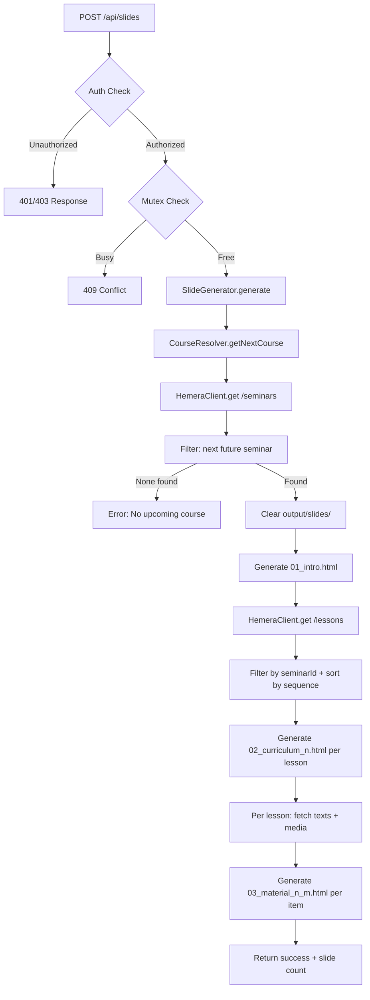

# Implementation Plan: Course Slides

**Branch**: `002-course-slides` | **Date**: 2026-02-12 | **Spec**: [spec.md](spec.md)
**Input**: Feature specification from `/specs/002-course-slides/spec.md`

## Summary

Generate a set of static HTML slides for the next upcoming course from the Hemera Academy API. The system fetches seminar, lesson, text content, and media asset data, then produces numbered HTML files: an intro slide with course name and dates, one curriculum slide per lesson, and one material slide per content item. Slides are optimized for 1920×1080 projection and triggered via a dedicated `POST /api/slides` endpoint. Reuses the existing HemeraClient, Zod schemas, and entity types from Spec 001.

## Technical Context

**Language/Version**: TypeScript 5+, Node.js (Next.js 16+ with App Router)
**Primary Dependencies**: Zod (validation), Clerk (auth/RBAC), HemeraClient (from Spec 001)
**Storage**: None (stateless — HTML slides generated to filesystem in `output/slides/`)
**Testing**: Vitest for unit/contract tests
**Target Platform**: Linux server (systemd service), self-hosted
**Project Type**: Web application (Next.js full-stack)
**Performance Goals**: Slide generation completes within 30 seconds for a typical course (up to 50 lessons)
**Constraints**: No local database (Constitution VII); reuse Spec 001 infrastructure; slides are static HTML only
**Scale/Scope**: Low tens to low hundreds of slides per course; single operator; single Linux host

## Constitution Check

*GATE: Must pass before Phase 0 research. Re-check after Phase 1 design.*

| Principle | Status | Notes |
|-----------|--------|-------|
| I. Test-First (NON-NEGOTIABLE) | ✅ PASS | Unit tests for slide generator, date formatting, filtering. Contract tests for API endpoint. TDD cycle enforced. |
| II. Code Quality & Formatting | ✅ PASS | Biome formatting/linting, strict TypeScript. |
| III. Feature Development Workflow | ✅ PASS | Spec-first (this plan), contract-first for API endpoint. |
| IV. Authentication & Security | ✅ PASS | Clerk auth for slides endpoint, admin role required. |
| V. Component Architecture | ✅ N/A | No UI components — slides are static HTML files. |
| VI. Error Handling & Observability | ✅ PASS | Error logging via Rollbar, meaningful error messages for missing courses. |
| VII. Stateless Architecture (NON-NEGOTIABLE) | ✅ PASS | No database. Fetch → generate HTML slides → filesystem. No local state beyond transient job tracking. |
| VIII. HTML Playback & Video Recording | ✅ RELATED | Slides are designed for the Full-Screen HTML Player (future feature). 1920×1080 layout. |
| IX. Aither Control API | ✅ RELATED | Slides endpoint can be integrated into the Control API in the future. |
| X. Language Policy | ✅ PASS | Code/comments/docs in English. Slide content (dates) in German (de-CH locale) — frontend text exception. |

**Gate Result: PASS — no violations.**

## Project Structure

### Documentation (this feature)

```text
specs/002-course-slides/
├── plan.md              # This file
├── spec.md              # Feature specification
└── tasks.md             # Phase 2 output (via /speckit.tasks)
```

### Source Code (repository root)

```text
src/
├── app/
│   └── api/
│       └── slides/
│           └── route.ts              # POST: trigger slide generation
├── lib/
│   ├── hemera/
│   │   ├── client.ts                 # Reused from Spec 001
│   │   ├── schemas.ts                # Reused from Spec 001
│   │   └── types.ts                  # Reused from Spec 001
│   └── slides/
│       ├── generator.ts              # Main slide generation orchestrator
│       ├── course-resolver.ts        # Determines next upcoming course
│       ├── slide-builder.ts          # Builds HTML content for each slide type
│       ├── html-layout.ts            # Base HTML layout template (1920×1080)
│       └── types.ts                  # TypeScript types for slide generation

tests/
├── contract/
│   └── slides-api.contract.spec.ts   # Contract tests for POST /api/slides
└── unit/
    ├── course-resolver.spec.ts       # Next course determination logic
    ├── slide-builder.spec.ts         # HTML content generation per slide type
    ├── slide-generator.spec.ts       # Full generation pipeline
    └── html-layout.spec.ts           # Layout template rendering
```

**Structure Decision**: Extends the existing Next.js App Router structure. New API route at `src/app/api/slides/`. Slide generation logic in `src/lib/slides/` as a self-contained module. Reuses `src/lib/hemera/` for API access. No new dependencies required — uses built-in `Intl.DateTimeFormat` for date formatting and `fs` for file output.

## Architecture Overview



## Key Design Decisions

### 1. No Template Engine

Unlike Spec 001 (which uses Handlebars for hemera.academy-authored templates), slide generation uses **programmatic string interpolation**. Aither controls the slide layout entirely — no external templates. This eliminates the Handlebars dependency for this feature.

### 2. Client-Side Filtering

API responses are filtered in-memory after fetching all records. This is acceptable because:
- Total record count is in the low hundreds
- Avoids dependency on undocumented API query parameters
- If server-side filtering becomes available, it can be added as an optimization

### 3. Stateless Slide Generation

No caching or incremental generation. Every invocation regenerates all slides from scratch. This is acceptable because:
- Slide count is small (tens to low hundreds)
- Generation is fast (< 30s target)
- Simplifies implementation significantly
- Consistent with Constitution VII (no local state)

### 4. 1920×1080 Fixed Layout

Slides use a fixed 1920×1080 pixel layout (not responsive). This is intentional:
- Designed for the Full-Screen HTML Player (Constitution VIII)
- Projection standard resolution
- Eliminates responsive design complexity
- CSS custom properties allow future branding without layout changes
