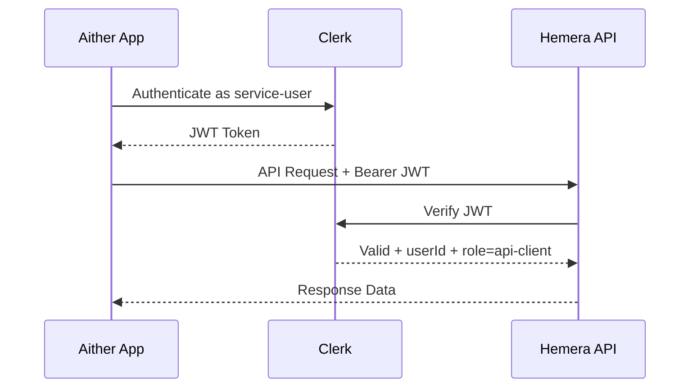

# Service User for Aither-Hemera API Integration

## Overview

This specification outlines the implementation of a dedicated service user in Clerk to enable secure API communication between Aither and Hemera applications. The service user will have restricted permissions to access only necessary course and participation data.

## Context

Aither (Next.js + Clerk) needs to access Hemera API to:
1. Read course/booking data (Courses, Bookings, Participants)
2. Write participant-specific results (CourseParticipation fields: `resultOutcome`, `resultNotes`)

Both applications use Clerk as the authentication provider.

## Requirements

### 1. Service User Creation
- Create a new Clerk user: `aither-service@hemera-academy.com`
- Assign `publicMetadata`: `{ "role": "api-client", "service": "aither" }`

### 2. Permission Model
Extend Hemera's permission system in `lib/auth/permissions.ts`:
- Add `api-client` role to `UserRole`
- Define permissions:
  - `read:courses` ✅
  - `read:bookings` ✅
  - `read:participations` ✅
  - `write:participation-results` ✅
  - `manage:courses` ❌
  - `manage:users` ❌

### 3. API Endpoints
Create new service endpoints under `/api/service/`:

| Endpoint | Method | Description |
|----------|--------|-------------|
| `/api/service/courses` | GET | Read courses with participant data |
| `/api/service/courses/[id]` | GET | Read single course with bookings |
| `/api/service/participations/[id]` | GET | Read participation details |
| `/api/service/participations/[id]/result` | PUT | Write result data |

Each endpoint must validate:
- User is authenticated via Clerk JWT
- User has `api-client` or `admin` role
- Permission is checked against the specific resource operation (e.g. `read:courses`, `write:participation-results`). Return `403 Forbidden` if the user's role lacks the required permission.

Error responses use a consistent JSON envelope:
```json
{
  "error": { "code": "<HTTP_STATUS>", "type": "<ERROR_TYPE>", "message": "<human-readable>" }
}
```

The `GET /api/service/courses` endpoint supports pagination via `?page=1&pageSize=50` query parameters (default `pageSize=50`, max `100`). Response includes `{ data: [...], pagination: { page, pageSize, total } }`.

### 4. Authentication Flow


### 5. Aither Implementation
- Use Clerk Backend SDK to generate service tokens
- Implement token caching and refresh logic
- Handle API calls to Hemera service endpoints

### 6. Security Requirements
- Principle of least privilege
- Audit trail via service user
- JWT validation by Clerk
- Rate limiting on `/api/service/*`
- Optional IP whitelisting

Additional Security Requirements (explicit):

- **HTTPS mandatory**: All client and service-to-service traffic MUST use TLS/HTTPS. HTTP endpoints are not permitted for production traffic and must redirect to HTTPS.
- **Rate limiting**: `/api/service/*` endpoints MUST enforce a per-service-user limit of `100 requests/minute` with a reasonable burst allowance; on exceeding limits return `429 Too Many Requests` and include a `Retry-After` header. Clients should implement exponential backoff when receiving 429s.
- **Security monitoring & alerting**: All service-user activity MUST be exported to centralized logging/monitoring (structured logs and metrics). Implement anomaly detection for unusual access patterns (e.g., spikes in requests, unusual endpoints accessed) and configure alerts for suspicious activity tiers (warning/critical). Ensure audit logs are tamper-evident and retained according to policy.
- **Token rotation & secret management**: Service credentials (API keys or secret tokens) MUST be stored in a secrets manager (Vault/AWS Secrets Manager/etc.). Define a rotation policy (e.g., rotate at least every 90 days or on suspected compromise), a revocation procedure, and an automated test/rollback process. Implement short-lived tokens where possible and proactive refresh with limited retries on expiry.
- **Least-privilege enforcement**: The `api-client` role MUST only have the permissions required (see Permission Model). Do not grant `manage:*` permissions to the service user.
- **Transport & encryption**: Secrets and tokens MUST never be logged in plaintext. Sensitive fields in logs must be redacted or hashed.
- **Incident handling**: Document a clear incident response flow for compromised service credentials: immediate revocation, rotation, audit review, and affected-data assessment.

## Implementation Notes

- Use short-lived JWTs (15 minutes) with proactive refresh
- Implement retry logic on token expiry
- Cache tokens appropriately for scalability
- Ensure server-side token management (no client-side session tokens)

## Environment Variables
- `HEMERA_API_BASE_URL`: Hemera API base URL
- `CLERK_SECRET_KEY`: Clerk backend secret for server-side SDK operations (keep in secrets manager)
- `NEXT_PUBLIC_CLERK_PUBLISHABLE_KEY`: Clerk publishable key required for client-side Clerk initialization
- `CLERK_SERVICE_USER_EMAIL`: Service user email reference (informational)
- `CLERK_SERVICE_USER_ID`: Clerk user id for the service user (used for lookups)
- `CLERK_SERVICE_USER_API_KEY` or `CLERK_SERVICE_USER_SIGNIN_TOKEN`: Service credential. Prefer `CLERK_SERVICE_USER_SIGNIN_TOKEN` (created via `clerkClient.signInTokens.createSignInToken()`) for short-lived M2M flows; fall back to a static API key stored in the secrets manager. Do NOT store plaintext passwords in source.

Notes:
- Both `NEXT_PUBLIC_CLERK_PUBLISHABLE_KEY` and `CLERK_SECRET_KEY` are typically required across Aither and Hemera for proper Clerk integration (client initialization and backend verification).
- Service credentials should be fetched from a vault or environment (in CI/CD) and never committed to the repository.

## Acceptance Criteria

- Service user can authenticate via Clerk
- Service endpoints reject unauthorized access
- Aither can successfully read/write required data
- Audit logs show service user actions
- No admin privileges exposed to service user