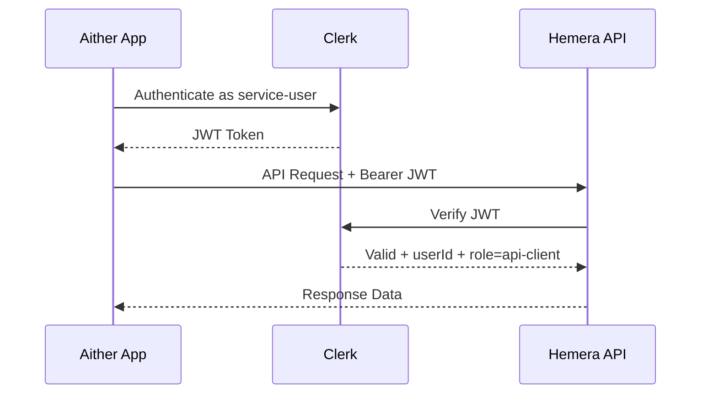

# Service User for Aither-Hemera API Integration

## Overview

This specification outlines the implementation of a dedicated service user in Clerk to enable secure API communication between Aither and Hemera applications. The service user will have restricted permissions to access only necessary course and participation data.

## Context

Aither (Next.js + Clerk) needs to access Hemera API to:
1. Read course/booking data (Courses, Bookings, Participants)
2. Write participant-specific results (CourseParticipation fields: `resultOutcome`, `resultNotes`)

Both applications use Clerk as the authentication provider.

## Requirements

### 1. Service User Creation
- Create a new Clerk user: `aither-service@hemera-academy.com`
- Assign `publicMetadata`: `{ "role": "api-client", "service": "aither" }`

### 2. Permission Model
Extend Hemera's permission system in `lib/auth/permissions.ts`:
- Add `api-client` role to `UserRole`
- Define permissions:
  - `read:courses` ✅
  - `read:bookings` ✅
  - `read:participations` ✅
  - `write:participation-results` ✅
  - `manage:courses` ❌
  - `manage:users` ❌

### 3. API Endpoints
Create new service endpoints under `/api/service/`:

| Endpoint | Method | Description |
|----------|--------|-------------|
| `/api/service/courses` | GET | Read courses with participant data |
| `/api/service/courses/[id]` | GET | Read single course with bookings |
| `/api/service/participations/[id]` | GET | Read participation details |
| `/api/service/participations/[id]/result` | PUT | Write result data |

Each endpoint must validate:
- User is authenticated via Clerk JWT
- User has `api-client` or `admin` role

### 4. Authentication Flow

### 5. Aither Implementation
- Use Clerk Backend SDK to generate service tokens
- Implement token caching and refresh logic
- Handle API calls to Hemera service endpoints

### 6. Security Requirements
- Principle of least privilege
- Audit trail via service user
- JWT validation by Clerk
- Rate limiting on `/api/service/*`
- Optional IP whitelisting

## Implementation Notes

- Use short-lived JWTs (15 minutes) with proactive refresh
- Implement retry logic on token expiry
- Cache tokens appropriately for scalability
- Ensure server-side token management (no client-side session tokens)

## Environment Variables

- `HEMERA_API_URL`: Hemera API base URL
- `CLERK_SECRET_KEY`: For backend SDK
- `CLERK_SERVICE_USER_EMAIL`: Service user email reference
- `CLERK_SERVICE_USER_ID` or API key: Service credentials

## Acceptance Criteria

- Service user can authenticate via Clerk
- Service endpoints reject unauthorized access
- Aither can successfully read/write required data
- Audit logs show service user actions
- No admin privileges exposed to service user