# Implementation Plan: Video & Audio Recording Module

**Branch**: `004-video-recorder` | **Date**: 2026-02-19 | **Spec**: [spec.md](spec.md)
**Input**: Feature specification from `/specs/004-recording-module/spec.md`

## Summary

Server-side video and audio recording module that captures a WLAN webcam's network stream (RTSP/HTTP/MJPEG) via FFmpeg as a child process, stores MP4 files locally in `output/recordings/`, and provides full API-driven playback control. The web player is a headless full-screen `<video>` surface that receives real-time commands via Server-Sent Events (SSE). The only new runtime dependency is `@mux/mux-node` (for US6 — MUX upload). FFmpeg is a system dependency, SSE uses native `ReadableStream`, and all in-memory state follows the existing sync route pattern.

## Technical Context

**Language/Version**: TypeScript 5.9+ on Node.js (Next.js 16+ App Router)  
**Primary Dependencies**: Next.js 16, Clerk auth, Zod, Rollbar (all existing); FFmpeg (system binary); `@mux/mux-node` (US6 only)  
**Storage**: Local filesystem (`output/recordings/`), gitignored. In-memory session state (no database).  
**Testing**: Vitest (unit + contract tests). FFmpeg mocked in tests via `child_process` spy.  
**Target Platform**: Node.js server (macOS/Linux). Browser for playback page only.  
**Project Type**: Web application (existing Next.js App Router project)  
**Performance Goals**: Capture at webcam native resolution (typically 1080p). SSE command latency < 500ms. Range-request streaming for seeking.  
**Constraints**: Max 15-minute recording (≈280 MB at 1080p/2.5 Mbps). Single concurrent recording session. Single concurrent playback per recording.  
**Scale/Scope**: Single-server deployment. Single webcam input. 1 operator + 1 display surface.

## Constitution Check

*GATE: Must pass before Phase 0 research. Re-check after Phase 1 design.*

### Pre-Design Check

| Principle | Status | Notes |
|-----------|--------|-------|
| **I — Test-First (NON-NEGOTIABLE)** | PASS | All modules will have unit tests (FFmpeg mocked) + contract tests for API routes. Test-first workflow enforced. |
| **II — Simplicity** | PASS | No new dependencies. FFmpeg spawned via `child_process`. SSE via `ReadableStream`. Built on existing patterns. |
| **III — Naming Consistency** | PASS | Follows existing conventions: `session-manager.ts`, `file-manager.ts`, `schemas.ts`, `types.ts`. Route structure mirrors `sync/` and `slides/`. |
| **IV — Idiomatic TypeScript** | PASS | Zod schemas as source of truth. Strict types inferred from schemas. No `any`. |
| **V — Documentation** | PASS | Spec, plan, research, data-model, contracts, quickstart all generated. |
| **VI — Environment Config** | PASS | New env vars (`WEBCAM_STREAM_URL`, `RECORDINGS_OUTPUT_DIR`) added to Zod `EnvSchema` via existing `loadConfig()` pattern. |
| **VII — Stateless (NON-NEGOTIABLE)** | PASS with justification | In-memory session state only (same as sync route). Filesystem output is an artifact, not application state. See Complexity Tracking. |
| **VIII — MUX as Video Store** | PASS | US6 provides explicit per-recording MUX upload via API command. Local files are output artifacts (like generated HTML); operator deletes them manually after upload. |
| **IX — Control API** | PASS | All endpoints designed for programmatic orchestration. No manual UI interaction required. |
| **X — Error Reporting** | PASS | `reportError()` for FFmpeg failures, webcam errors, and unexpected exceptions. |

### Post-Design Re-Check

| Principle | Status | Notes |
|-----------|--------|-------|
| **I — Test-First** | PASS | 7+ test files planned: 5 unit (ffmpeg-capture, session-manager, playback-controller, file-manager, mux-uploader) + 2 contract (recording-api, playback-api). |
| **VII — Stateless** | PASS | No persistent state. Module-level variables with `_resetState()` for tests. `output/recordings/` is gitignored output. |
| **VIII — MUX** | PASS | US6 provides explicit MUX upload. Local files are transient output artifacts; DELETE endpoint for lifecycle management. |

## Project Structure

### Documentation (this feature)

```text
specs/004-recording-module/
├── plan.md              # This file
├── research.md          # Phase 0: Technology decisions and rationale
├── data-model.md        # Phase 1: Entity definitions and state machines
├── quickstart.md        # Phase 1: Setup and usage guide
├── contracts/
│   └── openapi.yaml     # Phase 1: OpenAPI 3.1 contract
└── tasks.md             # Phase 2 output (NOT created by /speckit.plan)
```

### Source Code (repository root)

```text
src/
├── lib/
│   └── recording/
│       ├── session-manager.ts       # Recording lifecycle: start, stop, status, auto-stop timer
│       ├── ffmpeg-capture.ts        # FFmpeg child process spawn, SIGINT stop, stderr parsing
│       ├── file-manager.ts          # List, delete, metadata via fs + ffprobe
│       ├── playback-controller.ts   # Playback state machine, SSE dispatch, client registry
│       ├── stream-handler.ts        # HTTP Range request handling for video streaming
│       ├── mux-uploader.ts          # MUX direct upload: stream MP4, poll asset ready, get playback URL
│       ├── schemas.ts               # Zod schemas (source of truth for all types)
│       └── types.ts                 # TypeScript types inferred from Zod schemas
├── app/
│   ├── api/
│   │   └── recording/
│   │       ├── start/route.ts       # POST — start recording (admin)
│   │       ├── stop/route.ts        # POST — stop recording (admin)
│   │       ├── status/route.ts      # GET — current recording status (admin)
│   │       ├── list/route.ts        # GET — list all recordings (admin)
│   │       ├── [id]/route.ts        # DELETE — delete recording (admin)
│   │       ├── upload/
│   │       │   └── [id]/route.ts    # POST — upload to MUX + transmit URL (admin)
│   │       ├── stream/
│   │       │   └── [id]/route.ts    # GET — stream MP4 with Range support (admin/api-client)
│   │       ├── playback/
│   │       │   ├── play/route.ts    # POST — play command (admin/api-client)
│   │       │   ├── stop/route.ts    # POST — pause command (admin/api-client)
│   │       │   ├── rewind/route.ts  # POST — seek backward (admin/api-client)
│   │       │   ├── forward/route.ts # POST — seek forward (admin/api-client)
│   │       │   └── state/route.ts   # POST — player state report
│   │       └── events/route.ts      # GET — SSE endpoint for playback commands
│   └── recording/
│       └── player/
│           └── [id]/
│               └── page.tsx         # Full-screen HD player (no UI controls)

tests/
├── unit/
│   ├── ffmpeg-capture.spec.ts       # FFmpeg spawn, SIGINT, stderr, timeout
│   ├── session-manager.spec.ts      # Start/stop lifecycle, mutex, auto-stop
│   ├── playback-controller.spec.ts  # State machine, SSE dispatch, seek
│   ├── file-manager.spec.ts         # List, delete, metadata, edge cases
│   └── mux-uploader.spec.ts         # MUX upload, poll, playback URL, error handling
└── contract/
    ├── recording-api.contract.spec.ts   # Start/stop/status/list/delete/stream/upload
    └── playback-api.contract.spec.ts    # Play/stop/rewind/forward/state/events
```

**Modified existing files**:
- `src/lib/config.ts` — Add `WEBCAM_STREAM_URL`, `RECORDINGS_OUTPUT_DIR`, `MUX_TOKEN_ID`, and `MUX_TOKEN_SECRET` to `EnvSchema`
- `src/proxy.ts` — Add `/api/recording(.*)` and `/recording(.*)` to protected routes
- `src/lib/auth/permissions.ts` — Add `manage:recordings` and `control:playback` permissions

**Structure Decision**: Follows the existing Next.js App Router + `src/lib/` domain module pattern. Recording logic is in `src/lib/recording/` (like `src/lib/sync/` and `src/lib/slides/`). API routes are in `src/app/api/recording/` with sub-routes for each action. The player page is at `src/app/recording/player/[id]/page.tsx`.

## Architecture Overview

```mermaid
graph LR
    subgraph "WLAN Network"
        CAM[WLAN Webcam<br/>RTSP/HTTP/MJPEG]
    end

    subgraph "Aither Server (Node.js)"
        API[Recording API<br/>/api/recording/*]
        FFM[FFmpeg<br/>child_process]
        SM[Session Manager<br/>in-memory state]
        FM[File Manager<br/>fs operations]
        PC[Playback Controller<br/>SSE + state]
        SH[Stream Handler<br/>Range requests]
    end

    subgraph "Filesystem"
        OUT[output/recordings/<br/>rec_*.mp4]
    end

    subgraph "Browser"
        PL[Player Page<br/>/recording/player/id]
    end

    CAM -->|stream| FFM
    API -->|spawn/kill| FFM
    FFM -->|write| OUT
    API --> SM
    API --> FM
    API --> PC
    FM -->|read/delete| OUT
    SH -->|serve| OUT
    PL -->|video src| SH
    PC -->|SSE commands| PL
    PL -->|POST state| API
```



## Key Design Decisions

| Decision | Choice | Rationale |
|----------|--------|-----------|
| Stream capture | FFmpeg child process | De facto standard for RTSP/HTTP/MJPEG. No npm dependencies needed. |
| Output format | MP4 (H.264+AAC) | Maximum browser compatibility. `-c copy` when webcam provides H.264. |
| Real-time commands | SSE (Server-Sent Events) | Unidirectional server→player. Native `ReadableStream` in Next.js. No WebSocket server needed. |
| Session state | In-memory module variables | Constitution VII compliant. Same pattern as sync route. `_resetState()` for tests. |
| File storage | Local `output/recordings/` | Gitignored output artifact. MUX deferred per spec scope. DELETE for lifecycle. |
| Auth model | admin: record; admin+api-client: playback | Consistent with existing RBAC. Recording is destructive; playback is read-oriented. |
| Route namespace | `/api/recording/` (singular) | Avoids collision with existing `/api/recordings/` (plural, MUX upload from Spec 001). |
| Max duration | 15 minutes, auto-stop | Prevents disk exhaustion. Warning at 14 min. Timer triggers graceful SIGINT. |
| Graceful shutdown | SIGINT → 5s grace → SIGKILL | SIGINT lets FFmpeg write moov atom for valid MP4. SIGKILL as safety fallback. |
| New dependencies | `@mux/mux-node` (US6 only) | `child_process`, `ReadableStream`, `fs/promises` are built-in. MUX SDK required for US6 upload. |

## Complexity Tracking

> **Filled because Constitution Check has violations that must be justified**

| Violation | Why Needed | Simpler Alternative Rejected Because |
|-----------|------------|-------------------------------------|
| Constitution VIII — local file storage alongside MUX | Local files are retained as output artifacts for immediate LAN playback. US6 provides explicit MUX upload per recording; after upload, operator deletes local file manually via DELETE endpoint. | Auto-deleting local files after MUX upload would break LAN playback if the operator needs to replay locally. Manual lifecycle is intentional. |
| Constitution VII — filesystem writes | Recording files are output artifacts, not application state. `output/` is gitignored. The sync module writes HTML files to `output/` with the same justification. | In-memory-only storage is impractical for video files (~280 MB per 15-min recording). |
